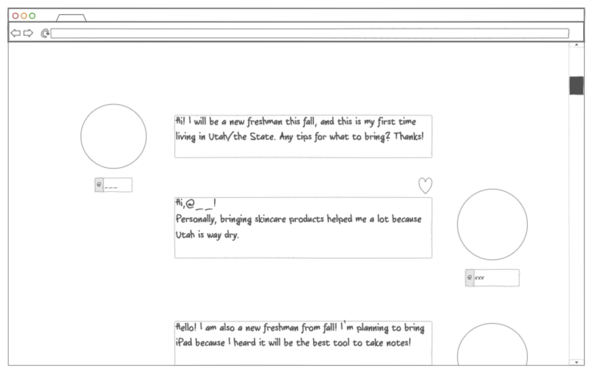

# startup

**How to secure a webpage** 

    When you have a not secure from the location var:

    request HTTPS -> Caddy -> Let's Encrypt -> secured!

    1. SSH to WSA from my terminal

    2. Type below on your terminal 
	    cd ~
	    sudo vi Caddyfile

    3. type ‘I” to edit and Change three parts 
	    :80 -> askcougars.click
	    startup.yourdomain -> startup.askcougars.click
	    simon.yourdomain -> simon.askcougars.click

    4. Type esc on your keyboard to finish editing, type :wq to save and quit

    5. Type below so that changes can effect
	    sudo service caddy restart

    6. Secured! Check your webpage’s location bar!

    *The secure version of HTTP is called Secure Hypertext Transport Protocol (HTTPS)

    Below would help to see the negotiations and make sure https://byu.edu has valid certificate.
    curl -v -s https://byu.edu > /dev/null

**How to make deployFiles.sh script for own html website** 

    Read deployFiles.sh to understand what is going to do.
    
	This case,scp (secure copy) to copy all files from the current directory to your server's public_html directory. The public_html directory is the 	  location where Caddy (your web server) looks for static pages to host.
	
	Type the line below from the working repository
	
	./deployWebsite.sh  -k ~/keys/production.pem -h funkychickens.click

**How to make deployFiles.sh script for simon project work** 

    Read deployFiles.sh to understand what is going to do.

        1)deletes any previous deployment for simon, 

        2)copies up all of the files found in the project directory,

        3)makes sure Caddy is hosting the files under the simon subdomain of your domain
        (e.g. simon.yourdomain.click).
	
	Type the line below from the working repository

    	./deployFiles.sh -k ~/keys/production.pem -h yourdomain.click -s simon
	
**Things I learned from simon-css assignmet**

	1)Need to think about where to use class
	
	2)Need to think about how much html can handle and let css handle the rest
	
	3)Need to think about how to make stuff appear by using css ex) circle.
	
	4)Need to remember to add <link rel="stylesheet" href="main.css" /> to make main.css to effect on things.
	
	5)If I want to add bootstrap, need to add line below before </head> part.
	<link href="https://cdn.jsdelivr.net/npm/bootstrap@5.2.2/dist/css/bootstrap.min.css" rel="stylesheet"
        integrity="sha384-Zenh87qX5JnK2Jl0vWa8Ck2rdkQ2Bzep5IDxbcnCeuOxjzrPF/et3URy9Bv1WTRi" crossorigin="anonymous" />
	
# Ask Cougars

## Design

This fall, I will be a new freshman at BYU! But, there are lots that I don’t know and worry about. How can I study effectively? Which classes should I take in the first semester? Where can I go shopping for groceries? ..etc. 

**“Ask Cougars”** provides connections between you and other students at BYU to ask any questions regarding school life so that you will be well prepared. You can also ask cougars where are the best places to go on dates or ideas for proposing to loved ones! Questions can be yours.

## Key features
    -Creating accounts and logging in

    -Ability to type the question to ask

    -Display of questions and comments from others

    -Questions and comments are persistently stored

    -Ability to delete and edit your questions or comments

    -Liked from all users displayed in real-time

    -Ability for admin to delete any inappropriate questions or comments 

    -Display the date questions and comments were posted

